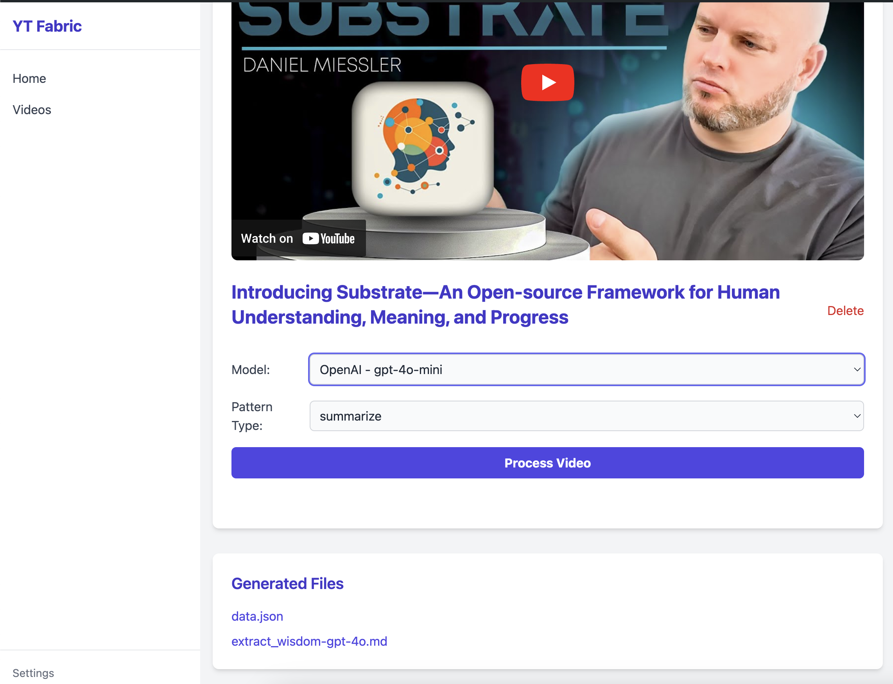

# Project Name

This project is an early work in progress (WIP) that leverages the [fabric](https://github.com/danielmiessler/fabric) framework for augmenting humans using AI. The project aims to provide a modular framework for solving specific problems using a crowdsourced set of AI prompts.

## Table of Contents

- [Installation](#installation)
- [Usage](#usage)
- [Screenshots](#screenshots)  <!-- Added new section to the Table of Contents -->
- [Contributing](#contributing)

## Installation

To get started with this project, you need to install the `fabric` framework on your system. Follow the steps below to install `fabric`:

1. **Install Go**: Make sure you have Go installed on your system. You can download it from [here](https://golang.org/dl/).

2. **Install Fabric**: Run the following command to install `fabric` directly from the repository:

    ```sh
    go install github.com/danielmiessler/fabric@latest
    ```

3. **Run Setup**: Now run the following command to set up your directories and keys:

    ```sh
    fabric --setup
    ```

4. **Run the web server**: Now you can run the web server with the following command:

    ```sh
    go run main.go
    ```

## Screenshots

### Home Page


### Video Page


### Videos List


## Contributing

Contributions are welcome! If you have any ideas, suggestions, or bug reports, please open an issue or submit a pull request.

